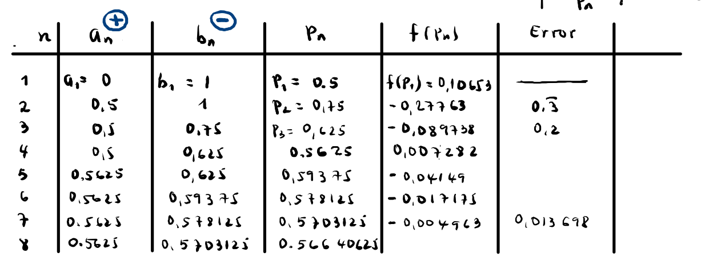
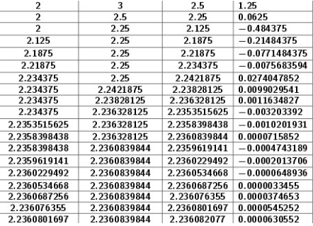
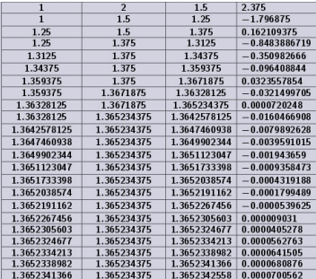

# Pruebas

## Método de Taylor

### Encontrar el polinomio

#### Prueba 1

f(x) = ```x*exp(-x)```
Grado del polinomio: ```3```
X~0~ = ```0```
Valor a aproximar X~1~ = ```0.25```

#### Resultado esperado:

Polinomio: \[
\frac{x^3}{2} - x^2 + x
\]

Aproximación: \[p(0.25)= 0.1953125\]
Valor Real: \[f(0.25)= 0.194700\]
Error absoluto: \[0.0006123\]
Cota Máxima: \[0.0006510\]

#### Prueba 2

f(x) = ```x*exp(x-1)```
Grado del polinomio: ```3```
X~0~ = ```1```
Valor a aproximar X~1~ = ```0.9```

Polinomio: \[
2x + \frac{2(x-1)^3}{3} + \frac{3(x-1)^2}{2} - 1
\]

Aproximación: \[p(0.9)= 0.7843\]
Valor Real: \[f(0.9)= 0.814354\]
Error absoluto \[0.030054\]
Cota Máxima \[0.00002083\]

### Encontrar el grado del polinomio

#### Prueba 1

f(x) = ```ln(x)```
Grado del polinomio: Puedes poner cualquiera, por ejemplo 1, no afectara
X~0~ = ```exp(1)```
X~1~ = ```3```

Error/Presición = ```0.0001```

#### Resultado esperado:

Grado del polinomio: \[3\]

#### Prueba 2

f(x) = ```sin(x)```
Grado del polinomio: Puedes poner cualquiera, por ejemplo 5, no afectara
X~0~ = ```pi/6```
X~1~ = ```28*pi/180```

Error/Presición = ```0.00001```

#### Resultado esperado:

Grado del polinomio: \[2\]

## Operaciones Binarias

Para esta función la escritura es muy sencilla, solo debes tener en cuenta:

- Decimales: Solo se admiten naturales, es decir sin .
- El Segundo campo para escribir solo se utiliza en los casos de sumar, restar, multiplicar y dividir binarios.

Ejemplo: 

| Operación      | Campo 1 | Campo 2 | Resultado |
| -------------- | ------- | ------- | --------- |
| Suma           | `1010`  | `1100`  | `10110`   |
| Resta          | `1100`  | `1010`  | `0010`    |
| Multiplicación | `101`   | `11`    | `1111`    |
| División       | `1100`  | `10`    | `110`     |

## Método de Bisección

#### Prueba 1
f(x) = ```exp(-x)-x```
Extremos: $\`[a,b]$
a: ```0```         b: ```1```
Criterio Error: ```0.0001```

#### Resultado esperado:

Raiz: \[\sqrt{x}=\]
Tabla:


#### Prueba 2

f(x) = ```x**2-5```
Extremos: $\`[2,3]$
Criterio Error: ```0.0001```

#### Resultado esperado:

Raiz: \[\sqrt{5}=2.2360679775\]
Tabla:


#### Prueba 3

f(x) = ```x**3 + 4*x**2 - 10```
Extremos: $\`[1,2]$
Criterio Error: ```0.0001```

#### Resultado esperado:

Raiz: \[\sqrt{x}=\]

Tabla:


## Método de Newton-Raphson


## Método de Lagrange

## Mínimos Cuadrados

## Diferencias Divididas

## Diferencias Finitas